
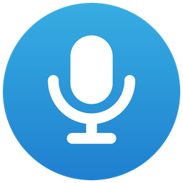

<h1 align="center">SuperDictate</h1>

Private dictation for Windows and Mac. Press a key, speak, and your words
appear where your cursor is, in any app. Speech is recognized on your own
computer: your voice never leaves it.

  
  
  
  

<b>English</b> · <a href="README.ru.md">Русский</a>

  <a href="docs/media/showcase.mp4">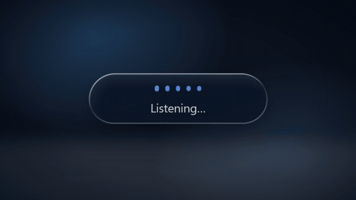</a>
   
  <a href="docs/media/showcase.mp4">Watch the 24-second tour</a>: the capsule, Liquid Glass, all fifteen skins and the languages.

## Download

Get both from the [latest release](https://github.com/ZazaKin/SuperDictate-windows/releases/latest).

| | Windows | Mac |
|---|---|---|
| **File** | `SuperDictate-Setup-<version>.exe` | `SuperDictate-macOS-<version>.zip` |
| **Needs** | 64-bit Windows 10 (2004 or later) or 11 | A Mac with Apple Silicon (M1 or newer), macOS 14 or newer |
| **Speech** | Whisper, on the processor or an NVIDIA graphics card | NVIDIA Parakeet v3, on the Apple Neural Engine |
| **Languages** | The same 25 European languages | 25 European languages |
| **Install guide** | [Windows guide](docs/user-guide.md) | [Mac guide](docs/mac-guide.md) |

Both are free. A one-time download of the speech model is the only time the
app needs the internet.

## What it does

- **Dictate in any app.** A hotkey (**Right Alt** on Windows, **Right ⌘** on a
  Mac) starts and stops; the text is typed where the cursor is. Hold-to-talk
  works too, and Windows has a floating microphone button.
- **See your words as you speak.** A capsule floats over your screen and
  writes a live draft. When you stop, the whole recording is transcribed
  again, so the typed text is a little better than the draft.
- **Make the capsule yours.** Fifteen skins, including Liquid Glass and seven with moving art that rises with your voice. Choose
  the accent color, size, opacity, voice meter and how wide it grows, put it in any corner or drag
  it anywhere. Next to the left or right edge it grows away from that edge.
- **Your languages.** Pick the languages you speak; detection chooses among
  them only. Switch from the tray (Windows) or the menu bar (Mac).
- **Stops by itself.** A minute without speech ends the dictation and types
  what you said.
- **Private.** No account, no ads, no analytics. Audio and transcripts stay on
  your computer.
- **AI cleanup** (Windows, optional). Tidy punctuation with built-in rules, a
  local model through Ollama, or a cloud service you choose.

### The capsule

  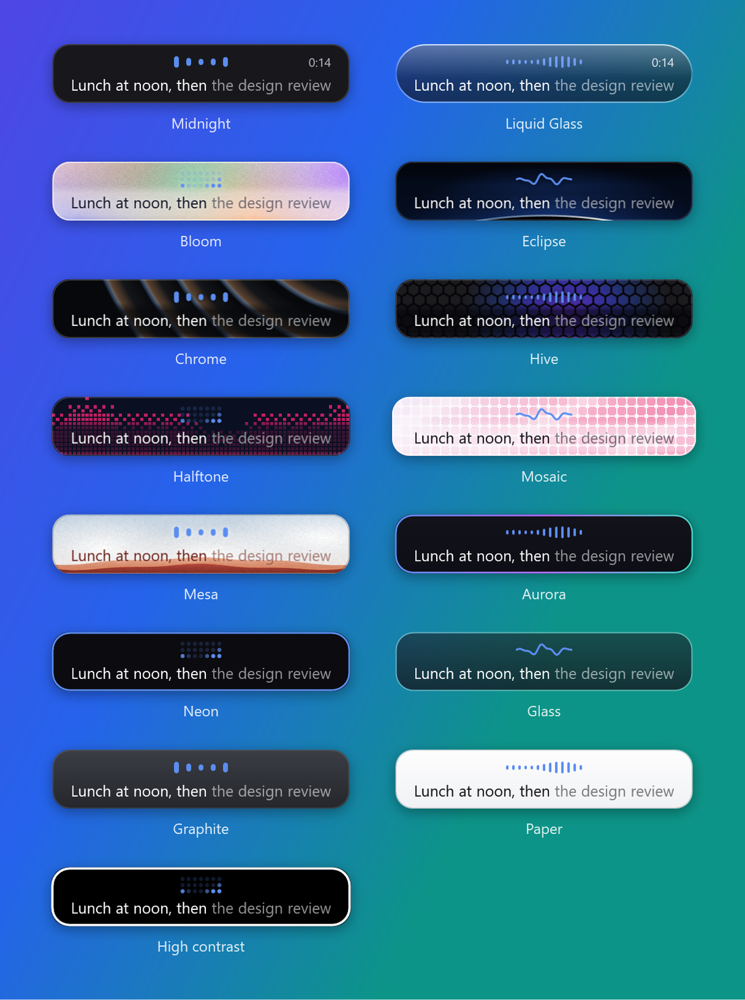
  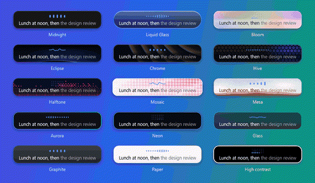

On a Mac with macOS 26, the Liquid Glass skin is Apple's own glass. On Windows
it's live glass too: the screen behind bends at its edge and the words flip
between dark and light with it. On older Macs it's a close recreation.

  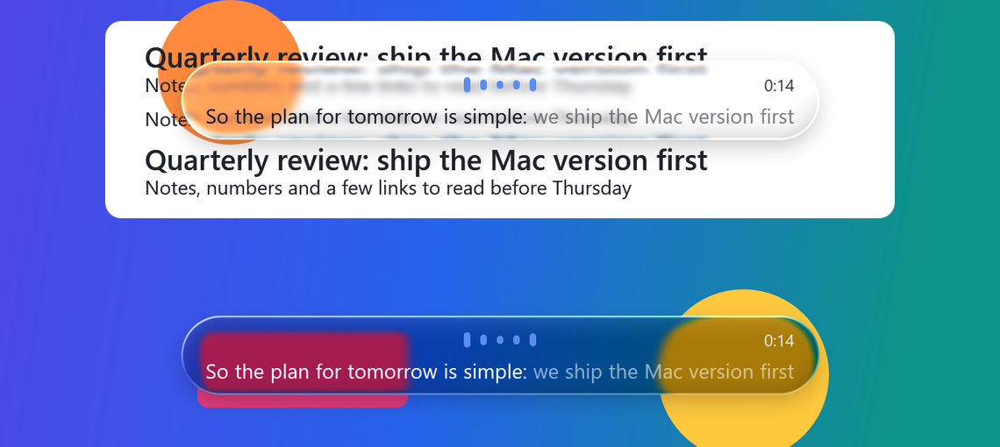

### Windows

<table>
  <tr>
    <td>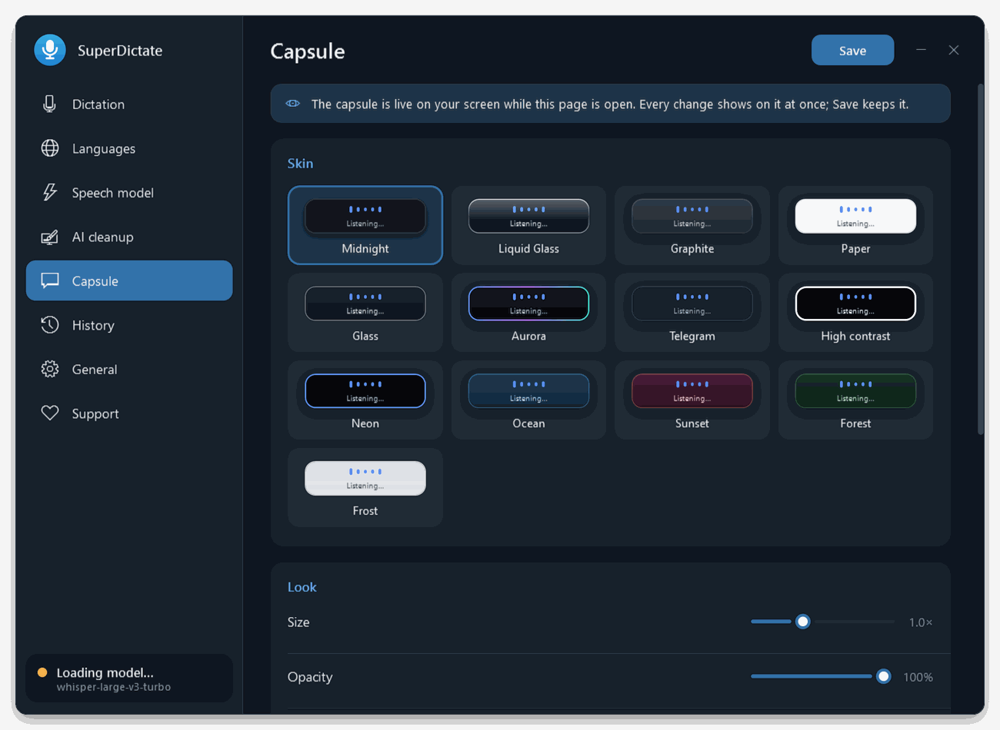</td>
    <td>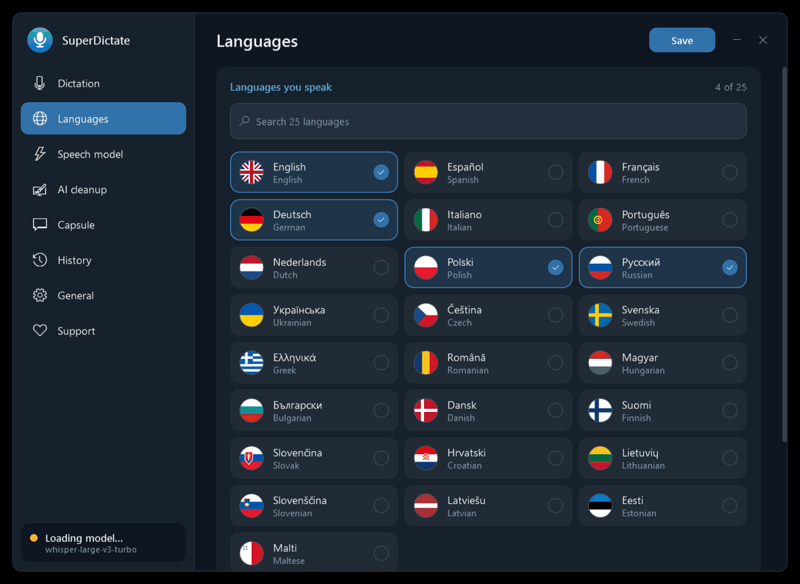</td>
  </tr>
  <tr>
    <td>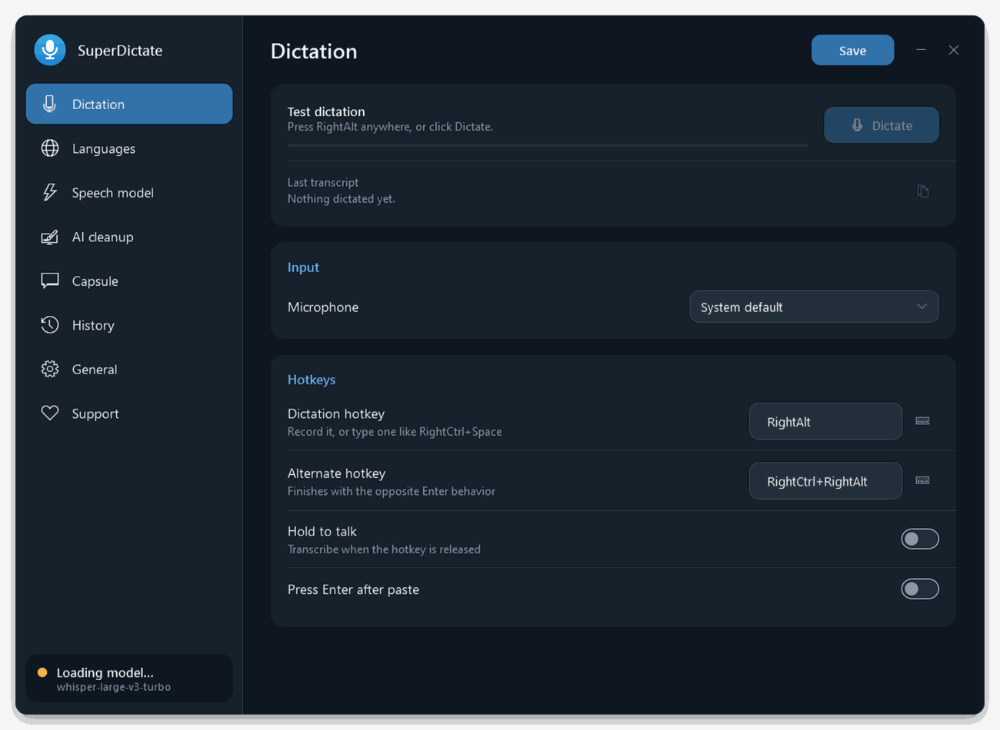</td>
    <td>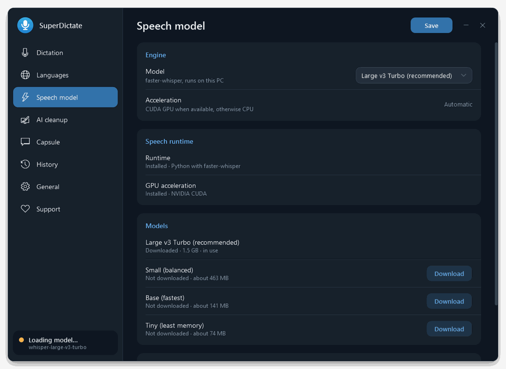</td>
  </tr>
</table>

### Mac

<table>
  <tr>
    <td>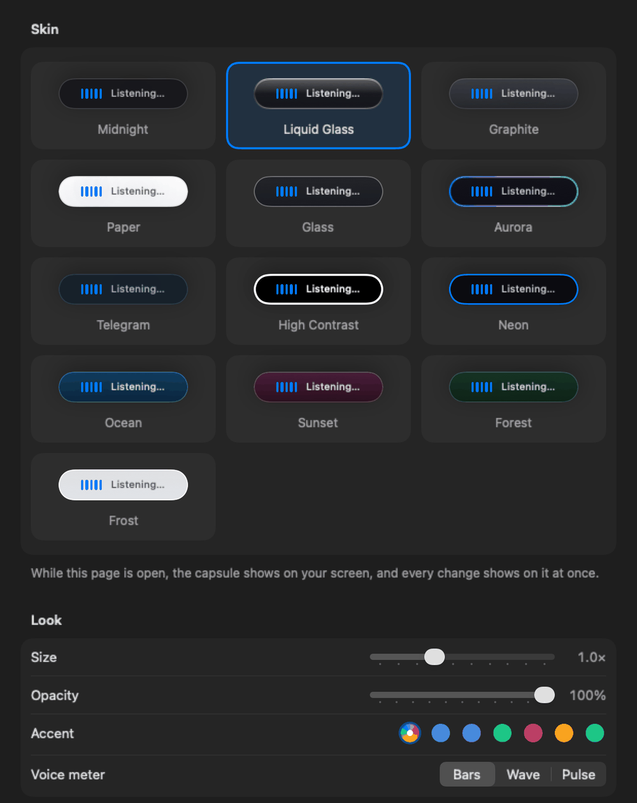</td>
    <td>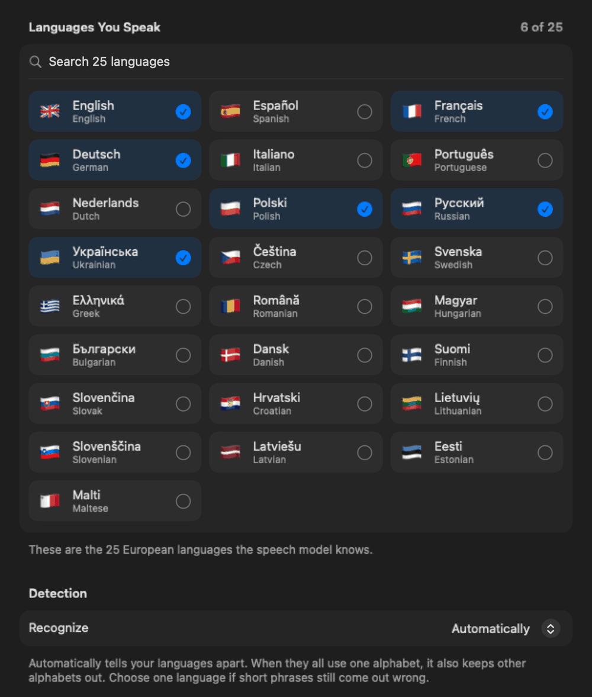</td>
  </tr>
  <tr>
    <td>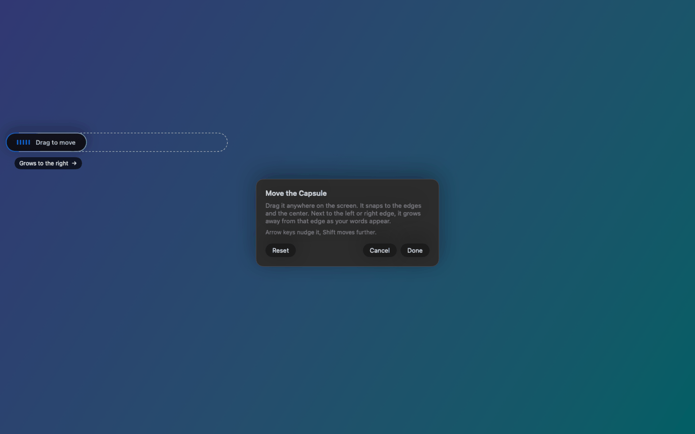</td>
    <td>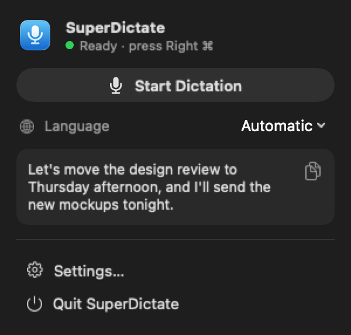</td>
  </tr>
</table>

## Install

### Windows

1. Download `SuperDictate-Setup-<version>.exe` from the
   [latest release](https://github.com/ZazaKin/SuperDictate-windows/releases/latest)
   and run it. If Windows says "Windows protected your PC", click
   **More info** › **Run anyway**.
2. Choose a folder and click **Install**. No administrator rights needed.
3. In the settings that open, click **Install** under **Speech runtime**, then
   **Download** next to a model (Large v3 Turbo is recommended).
4. When the status says **Ready**, press **Right Alt**, speak, and press it
   again.

Step by step, with every setting explained: the [Windows guide](docs/user-guide.md).

### Mac

1. Download `SuperDictate-macOS-<version>.zip` from the
   [latest release](https://github.com/ZazaKin/SuperDictate-windows/releases/latest),
   open it, and drag **SuperDictate** into **Applications**.
2. Open it. The app isn't notarized by Apple yet, so the first time macOS
   blocks it: open **System Settings › Privacy & Security** and click
   **Open Anyway**.
3. The setup window asks for three permissions (Microphone, Accessibility,
   Input Monitoring) and downloads the speech model (about 460 MB).
4. Press **Right ⌘**, speak, and press it again.

Step by step, with pictures of each step: the [Mac guide](docs/mac-guide.md).

## Updates

- **Windows:** **Settings › Support › Check for updates**. The update is
  downloaded, checked against its SHA-256 and installed on a click.
- **Mac:** download the new zip from the releases page and replace the app in
  Applications.

Neither app goes online by itself. What's new in each version is in the
[release notes](docs/releases/).

## Privacy

Audio and transcripts stay on your computer; logs never contain what you said.
The internet is used only when you click: downloading the speech engine and
models, checking for updates, and AI cleanup through a cloud service if you
turn that on. Details for both apps are in [PRIVACY.md](PRIVACY.md).

## Help

- How-tos and troubleshooting: the [Windows guide](docs/user-guide.md) and the
  [Mac guide](docs/mac-guide.md).
- Something broken, or an idea: [GitHub Issues](https://github.com/ZazaKin/SuperDictate-windows/issues/new/choose).
- Security issues: see [SECURITY.md](SECURITY.md).

## For developers

Both apps live in this repository:

| Part | Where |
|---|---|
| Windows app (.NET 8, WPF) | [`src/SuperDictate`](src/SuperDictate) |
| Mac app (SwiftUI, Swift package) | [`macos/`](macos/README.md) |
| Build, install and release scripts (Windows) | [`scripts/`](scripts) |
| Documentation, pictures, release notes | [`docs/`](docs) |
| Website | [`website/`](website/README.md) |

How to build, test, install a development copy and make a release is in
[docs/development.md](docs/development.md). Read [AGENTS.md](AGENTS.md) first:
it lists the rules every change must keep. Contributions:
[CONTRIBUTING.md](CONTRIBUTING.md).

## License

SuperDictate is licensed under MIT with the
[Commons Clause](https://commonsclause.com): you may use it for free (including
at work), change it and share it, but you may not sell it, nor paid services
whose value comes entirely or substantially from it. Full text in
[LICENSE](LICENSE).

The project is based on [Parakey](https://github.com/rcourtman/parakey) by
Richard Courtman; those parts remain under their original MIT license, kept in
`LICENSE`. Third-party components and models are listed in
[NOTICE.md](NOTICE.md).

## Support the project

SuperDictate is free. If it saves you time, you can support its development:

<!-- donations: build-release.cmd fills this list from release-settings.ini -->
- **Ko-fi**: [ko-fi.com/zazakin](https://ko-fi.com/zazakin) - Card or PayPal
- **Buy Me a Coffee**: [buymeacoffee.com/zazakin](https://buymeacoffee.com/zazakin) - Card
- **USDT / USDC (EVM)**: `0xEB571a20373a439f9c97EAA203b6c86B927B3482` - Same address on Ethereum, BNB Chain, Polygon, Arbitrum, Base
- **USDT (TRC20)**: `TAUv9GctsU5hCbd5K48otaZBt6H5fLULeb` - TRON network only
- **Solana**: `22qrMU3Jk5rrace5sWS88pqo1AoTftmfHNe4QaNs8nTQ` - USDC or SOL on Solana only
- **Bitcoin**: `bc1q28r8zrnug2jhkn4p33836flhkp78dz6neghhe4` - Bitcoin network only
<!-- /donations -->

The same options are in the Windows app under **Settings › Support**. Send
crypto only on the network named next to the address. Thank you!
