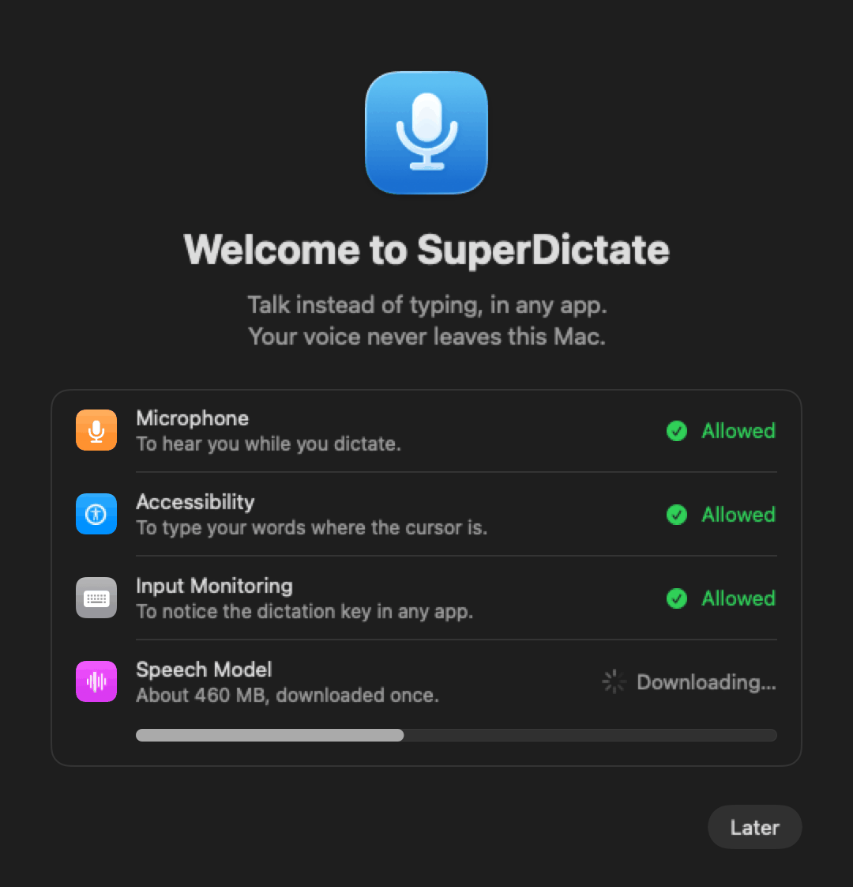

# SuperDictate для Mac: установка и инструкция

[English](mac-guide.md) · **Русский**

SuperDictate превращает речь в текст в любом приложении на Mac. Нажмите
**правый ⌘**, говорите, нажмите его ещё раз — и слова напечатаются там, где
стоит курсор. Речь распознаётся на самом Mac, нейросетевым ядром Apple: голос
никуда не отправляется.

Интерфейс приложения на английском, поэтому названия его кнопок и вкладок ниже
даны так, как они выглядят в приложении. Названия разделов macOS даны так, как
они выглядят в русской macOS.

- [Требования](#требования)
- [Установка](#установка)
- [Первый запуск: разрешения и модель](#первый-запуск-разрешения-и-модель)
- [Диктовка](#диктовка)
- [Панель в строке меню](#панель-в-строке-меню)
- [Настройки](#настройки)
- [Обновление](#обновление)
- [Приватность и где что хранится](#приватность-и-где-что-хранится)
- [Удаление](#удаление)
- [Если что-то не работает](#если-что-то-не-работает)

## Требования

- Mac на Apple Silicon: M1 или новее. Mac с процессором Intel не
  поддерживаются.
- macOS 14 Sonoma или новее. На macOS 26 капсула может быть настоящим Liquid
  Glass.
- Около 1 ГБ свободного места под модель распознавания.
- Интернет один раз — скачать модель (около 460 МБ). После этого диктовка
  работает без интернета.

## Установка

1. Откройте страницу
   [последнего выпуска](https://github.com/ZazaKin/SuperDictate-windows/releases/latest)
   и скачайте `SuperDictate-macOS-<версия>.zip`. По желанию сверьте его SHA-256
   с файлом `SHA256SUMS.txt` там же — в Терминале:
   `shasum -a 256 ~/Downloads/SuperDictate-macOS-*.zip`.
2. Откройте zip в папке **Загрузки**. Он распакуется в **SuperDictate**.
3. Перетащите **SuperDictate** в папку **Программы**. Запускайте его только
   оттуда.
4. Откройте **SuperDictate** из «Программ». Apple это приложение пока не
   заверила, поэтому в первый раз macOS остановит его с сообщением, что не
   может проверить его на вредоносное ПО. Нажмите **Готово** (или **ОК**), затем:
   1. Откройте **Системные настройки › Конфиденциальность и безопасность**.
   2. Прокрутите вниз до раздела **Безопасность**. Рядом с надписью о том, что
      SuperDictate заблокирован, нажмите **Всё равно открыть**.
   3. Введите пароль и ещё раз нажмите **Всё равно открыть**.

   На macOS 14 можно иначе: щёлкните SuperDictate в «Программах» правой
   кнопкой, выберите **Открыть**, затем ещё раз **Открыть**. Это нужно сделать
   только один раз.

> **«Приложение SuperDictate повреждено, и его не удаётся открыть»?** Так macOS
> пишет, когда на приложении, которое она не может проверить, осталась отметка
> загрузки из интернета. Сначала перенесите приложение в «Программы», затем
> один раз выполните в Терминале и откройте его снова:
>
> ```bash
> xattr -dr com.apple.quarantine /Applications/SuperDictate.app
> ```

SuperDictate живёт в строке меню: значка в Dock у него нет. Ищите волну в
строке меню вверху экрана.

## Первый запуск: разрешения и модель

<p align="center"></p>

В окне настройки — всё, что нужно SuperDictate. Каждая строка отмечается
галочкой, как только всё готово.

| Разрешение | Зачем | Где разрешить |
|---|---|---|
| **Microphone** (Микрофон) | Слышать вас во время диктовки | Нажмите **Allow…**, затем **Разрешить** в окне macOS |
| **Accessibility** (Универсальный доступ) | Печатать слова там, где курсор | **Системные настройки › Конфиденциальность и безопасность › Универсальный доступ** |
| **Input Monitoring** (Мониторинг ввода) | Замечать клавишу диктовки в любом приложении | **Системные настройки › Конфиденциальность и безопасность › Мониторинг ввода** |

Для универсального доступа и мониторинга ввода кнопка **Allow…** открывает
нужную страницу системных настроек. Включите переключатель рядом с
**SuperDictate**. Если его нет в списке, нажмите **+**, выберите
**SuperDictate** в «Программах» и включите. macOS может попросить закрыть и
снова открыть приложение: сделайте это из панели в строке меню
(**Quit SuperDictate**), затем откройте его снова из «Программ».

Затем нажмите **Download** рядом с **Speech Model**. Модель (около 460 МБ)
скачивается один раз с Hugging Face и готовится для нейросетевого ядра — в
первый раз это занимает минуту-две. Когда во всех строках галочки, нажмите
**Start Dictating**.

## Диктовка

1. Щёлкните туда, куда нужен текст: сообщение, документ, строка поиска.
2. Нажмите **правый ⌘** (клавиша Command справа). Вверху экрана появится
   капсула и начнёт слушать.
3. Говорите. Слова появляются в капсуле по ходу речи.
4. Нажмите **правый ⌘** ещё раз. Запись распознаётся и печатается у курсора.

- **Escape** во время диктовки отменяет её: ничего не напечатается.
- Минута без речи завершает диктовку сама и печатает сказанное.
- Очень короткое нажатие не считается: случайное нажатие ничего не делает.
- Если универсальный доступ не разрешён, текст копируется в буфер обмена, и
  капсула об этом скажет; вставьте его через ⌘V.

Черновик в капсуле быстрый и может меняться по ходу речи; когда вы закончите,
запись распознаётся целиком ещё раз, поэтому напечатанный текст бывает чуть
точнее черновика.

## Панель в строке меню

<p align="center"></p>

Щёлкните волну в строке меню, чтобы увидеть:

- состояние: готово, слушает, распознаёт или чего ещё не хватает для настройки;
- **Start Dictation** / **Stop Dictation** — если удобнее щёлкнуть;
- **Language** — автоматическое определение или один из ваших языков, а также
  **Choose Languages…**;
- последнюю диктовку с кнопкой копирования;
- **Finish Setup…**, пока чего-то не хватает, **Settings…** и **Quit**.

## Настройки

Откройте **Settings…** из панели в строке меню.

### General (Общие)

- **Open at login** — запускать SuperDictate при входе в систему.
- **Play sounds** — тихий звук в начале и в конце диктовки.
- **Permissions** — три разрешения и кнопка **Allow…** для недостающих.

### Dictation (Диктовка)

- **Key** — правый Command ⌘ (по умолчанию), правый Option ⌥, правый Control ⌃
  или fn (Глобус). Предлагаются только клавиши, которые сами по себе ничего не
  делают, поэтому их нажатие никогда ничего не напечатает.
- **Use** — нажать, чтобы начать, и ещё раз, чтобы закончить, или удерживать,
  пока говорите.
- **Press Return after typing** — сразу отправляет сообщение в чате. Никогда —
  если диктовка остановилась сама.

### Languages (Языки)

<p align="center"></p>

Отметьте языки, на которых говорите. Модель знает 25 европейских языков:
английский, испанский, французский, немецкий, итальянский, португальский,
нидерландский, польский, русский, украинский, чешский, шведский, греческий,
румынский, венгерский, болгарский, датский, финский, словацкий, хорватский,
литовский, словенский, латышский, эстонский и мальтийский.

**Recognize** задаёт, как слушать:

- **Automatically** — различает ваши языки сам. Если все они пишутся одним
  алфавитом (например, английский, немецкий и польский), он ещё и не пускает
  буквы других алфавитов в короткие неразборчивые фразы.
- **Only <язык>** — слушать только этот язык. Выберите его, если короткие фразы
  всё равно выходят не тем алфавитом. Например, если вы диктуете только
  по-русски, выберите **Only Russian**.

### Capsule (Капсула)

<p align="center"></p>

Пока эта вкладка открыта, на экране видна настоящая капсула с примером текста,
и каждое изменение сразу на ней отражается. Диктовка в это время ждёт: сочетание
клавиш показывает «Close Capsule settings to dictate».

- **Skin** — пятнадцать обложек. **Liquid Glass** на macOS 26 — настоящее
  стекло Apple (и там это вариант по умолчанию); на macOS 14 и 15 — близкое
  воссоздание. В семи обложках под словами движется картинка (**Bloom**,
  **Eclipse**, **Chrome**, **Hive**, **Halftone**, **Mosaic**, **Mesa**): за
  словами она затихает, чтобы их всегда было легко читать, а с Reduce Motion
  замирает.
- **Size**, **Opacity**, **Accent** (цвет индикатора голоса; Multicolor
  повторяет цвет акцента вашего Mac) и **Voice meter** (полоски, волна, точки
  или осциллограф).
- **Widest** — насколько широкой капсула становится по мере появления слов.
- **Place** — шесть положений у краёв и в углах или **Move…**, чтобы
  перетащить её куда угодно.
- **Screen** — экран, на котором вы работаете, или всегда основной.
- **Show words as you speak** и **Show recording time**.

<p align="center"></p>

В режиме **Move…** экран затемняется. Перетащите капсулу: она прилипает к
краям и к центральным линиям, которые подсвечиваются. Пунктир показывает,
насколько она вырастет, когда появятся слова: у левого или правого края она
растёт в сторону от края. Стрелки сдвигают её (с Shift — дальше). **Done** или
Return — сохранить, **Cancel** или Escape — отменить.

### Speech Model (Модель)

Состояние модели, её загрузка и **Show in Finder** — открыть её папку. Если
загрузка прервалась, **Try Again** продолжит.

### History (История)

Последние 100 диктовок, новые сверху. Наведите на запись, чтобы скопировать;
правая кнопка — скопировать или удалить. **Clear History…** удаляет все.

## Обновление

Сам себя SuperDictate для Mac пока не обновляет.

1. Скачайте новый `SuperDictate-macOS-<версия>.zip` со страницы
   [последнего выпуска](https://github.com/ZazaKin/SuperDictate-windows/releases/latest).
2. Закройте SuperDictate (панель в строке меню › **Quit SuperDictate**).
3. Перетащите новый **SuperDictate** в «Программы» и выберите **Заменить**.
4. Откройте его. В первый раз снова разрешите запуск в разделе
   «Конфиденциальность и безопасность», как при [установке](#установка).

Настройки, история и модель сохраняются. Поскольку приложение пока не
подписано сертификатом Apple, macOS может счесть новую версию другим
приложением и снова спросить универсальный доступ и мониторинг ввода. Если
переключатель включён, а диктовка не печатает, выберите **SuperDictate** в этом
списке, нажмите **−**, чтобы убрать его, и снова нажмите **Allow…** в
настройках SuperDictate.

## Приватность и где что хранится

- Голос распознаётся на Mac и никуда не отправляется. На диск ничего не
  записывается.
- В сеть приложение выходит только когда вы нажимаете **Download** для модели;
  она скачивается с Hugging Face.
- Ни аккаунта, ни рекламы, ни аналитики, ни телеметрии.

| Что | Где |
|---|---|
| Приложение | `/Applications/SuperDictate.app` |
| Модель распознавания | `~/Library/Application Support/FluidAudio/Models/` (**Settings › Speech Model › Show in Finder**) |
| История (последние 100 диктовок) | `~/Library/Application Support/SuperDictate/history.json` |
| Настройки | настройки macOS для `com.local.superdictate` |

## Удаление

1. Закройте SuperDictate из панели в строке меню.
2. Перетащите **SuperDictate** из «Программ» в Корзину.
3. Чтобы удалить и данные, удалите папки
   `~/Library/Application Support/SuperDictate` и
   `~/Library/Application Support/FluidAudio/Models` (в Finder: **Переход ›
   Переход к папке…** и вставьте путь), а в Терминале выполните
   `defaults delete com.local.superdictate`. Папку модели не трогайте, если
   FluidAudio пользуется другое приложение.
4. В **Системных настройках › Конфиденциальность и безопасность** уберите
   SuperDictate кнопкой **−** из списков «Микрофон», «Универсальный доступ» и
   «Мониторинг ввода».

## Если что-то не работает

| Что случилось | Что делать |
|---|---|
| Клавиша ничего не делает | Разрешите **мониторинг ввода**, затем закройте и снова откройте SuperDictate. Проверьте клавишу в **Settings › Dictation**. |
| Капсула появляется, но ничего не печатается | Разрешите **универсальный доступ**. Пока его нет, текст копируется; вставьте его через ⌘V. |
| «Allow the microphone first» | Разрешите **микрофон**: **Системные настройки › Конфиденциальность и безопасность › Микрофон**. |
| «No speech detected» | Проверьте устройство ввода в **Системных настройках › Звук › Вход** и говорите чуть громче или ближе. |
| Короткие фразы выходят не тем алфавитом | В **Settings › Languages** снимите отметки с языков, на которых вы не говорите, или выберите **Only <язык>**. |
| Текст на языке, которого модель не знает | Parakeet знает 25 европейских языков; остальные распознаются плохо. Приложение для Windows знает больше. |
| Загрузка модели остановилась | Нажмите **Try Again** в **Settings › Speech Model**. Нужно около 1 ГБ свободного места. |
| Разрешения включены, но после обновления не работают | Уберите SuperDictate из списка кнопкой **−** и разрешите снова (см. [Обновление](#обновление)). |
| «Приложение повреждено, и его не удаётся открыть» | См. примечание в разделе [Установка](#установка). |

Не помогло? Откройте [задачу на GitHub](https://github.com/ZazaKin/SuperDictate-windows/issues/new/choose)
(можно по-русски), укажите версию macOS и что вы уже пробовали.
